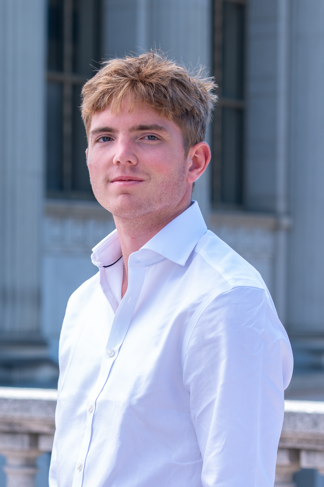

::::{grid} 1 2 2 2

:::{card}
:header: **Shobhana Murali Stoyanov**

+++

* **Office Hours**: Tue 10am-1pm (Evans 333) | Thu 1:30-3:30pm (Zoom) 
* [shobhana@berkeley.edu](mailto:shobhana@berkeley.edu)
:::

:::{card}
:header: **Oliver Maynard**

+++

* **Office Hours**: By appointment 
* [oli.may1@berkeley.edu](mailto:oli.may1@berkeley.edu)
* **Bio**: Hi! I'm Oli, one of the GSIs for this course. I got my undergraduate degree in Applied Mathematics from Berkeley, and I'm currently a student on the Statistics M.A. program. Outside of probability, I love playing Padél (the superior racket sport), eating breakfast and Marin county.

:::

:::{card}
:header: **Avani Kanungo**

+++

* **Office Hours**: 
* [avanikanungo@berkeley.edu](mailto:avanikanungo@berkeley.edu)
* **Bio**: Hi everyone, I'm Avani, one of the GSIs for this course! I got my undergraduate degree from UCLA studying Statistics and Data Science, and I'm currently working on my MPH in Epidemiology and Biostatistics. In my free time, I enjoy reading, baking, and playing tennis.
:::

:::{card}
:header: **Chuao Dong**

+++

* **Office Hours**: 
* [chuaodong@berkeley.edu](mailto:chuaodong@berkeley.edu)
* **Bio**: 
:::

:::{card}
:header: **Tobias Roemer**

+++

* **Office Hours**: 
* [tobias_roemer@berkeley.edu](mailto:tobias_roemer@berkeley.edu)
* **Bio**: Hi! I’m Toby—one of the GSIs. Previously, I worked on applied econometrics research at the University of Oxford and am now finishing an M.A. in Statistics at UC Berkeley. Outside of class, I enjoy running, surfing, building little tools that make life easier, and carpentry. 
:::

:::{card}
:header: **Xuanlin Mao**

+++

* **Office Hours**: 
* [xuanlinmao@berkeley.edu](mailto:xuanlinmao@berkeley.edu)
* **Bio**: Hi, I am Xuanlin. I graduated from Fudan University and am now a student of Statistics M.A. program. When I’m not studying, I love gaming, music, food, and guitar!
:::

:::{card}
:header: **Victor Ginsburg**

+++

* **Office Hours**: 
* [victor_ginsburg@berkeley.edu](mailto:victor_ginsburg@berkeley.edu)
* **Bio**: 
:::

:::{card}
:header: **Allen Ma Zhou**

+++

* [allenmzhou@berkeley.edu](mailto:allenmzhou@berkeley.edu)
* **Bio**: Hi y’all! I’m Allen, a junior from the Bay Area studying Statistics and Computer Science. I love soccer, track and field, and poker!
:::

:::{card}
:header: **Cynthia Xingdi Shi**

+++

* [cynthia.s23@berkeley.edu](mailto:cynthia.s23@berkeley.edu)
* **Bio**: My name is Cynthia, and I'm a junior majoring in Economics and Statistics. Outside of academics, I enjoy painting in my free time!
:::

:::{card}
:header: **Ethan Juan Chant**

+++

* [xx_ethan_xx@berkeley.edu](mailto:xx_ethan_xx@berkeley.edu)
* **Bio**: Hi, i’m ethan and im a senior studying both statistics and educational sciences. Part of the reason why i became a stat 134 tutor is because it’s a combination of both of my passions. Outside of stats i also teach at BUSD and afterschool programs in the bay.
:::

:::{card}
:header: **Jenny Gao**

+++

* [jennygao2004@berkeley.edu](mailto:jennygao2004@berkeley.edu)
* **Bio**: Hi, my name is Jenny and I’m a Junior studying statistics and psychology. I love tutoring because I am passionate about Statistics and I want to find ways to help people understand difficult concepts. Outside of class, I love to travel, snowboarding, and dancing.
:::

:::{card}
:header: **Neha Rashmi Suresh**

+++

* [neha_suresh@berkeley.edu](mailto:neha_suresh@berkeley.edu)
* **Bio**: Hi, I’m Neha, a junior studying Statistics and Data Science from the Bay. In my free time, I love to bake, go on day trips, and play badminton!
:::

::::
<!-- 
:::{attention} Welcome to [Week 2](#week2) of Stat 134!
:class: dropdown
:icon: false
👋
:::

# Schedule

You can have freestyle HTML with colors and styles. For example, this text is blue.

The table below is rendered by the `schedule` plugin, contributed by [rowanc1](https://github.com/rowanc1). It is declared in `myst.yml` and contained within `schedule.mjs`. It reads in the data in `schedule.yml` and converts it into a table.

:::{schedule} ./schedule.yml

::: -->
